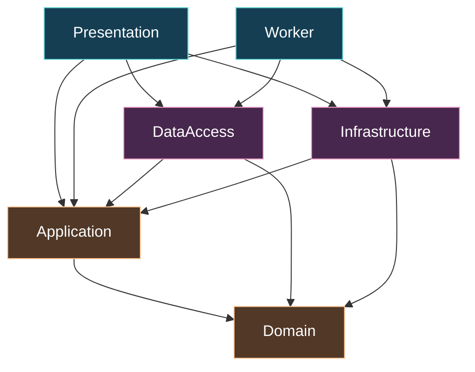
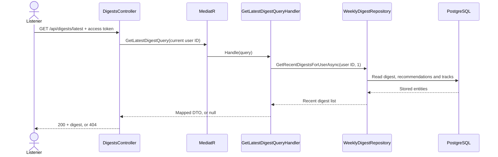
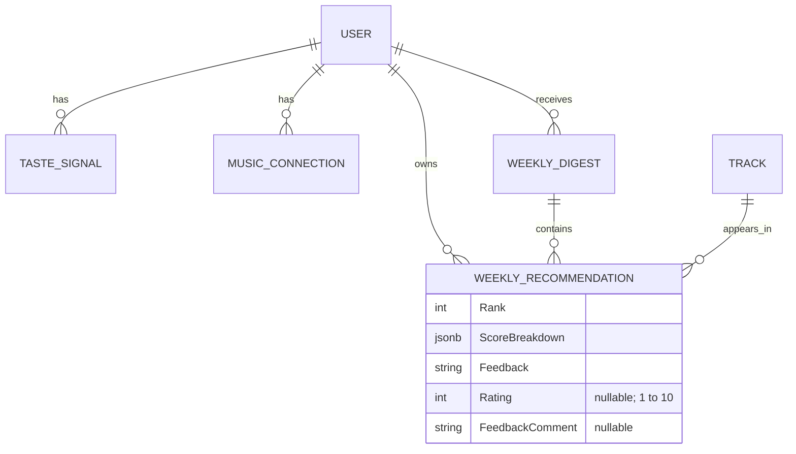
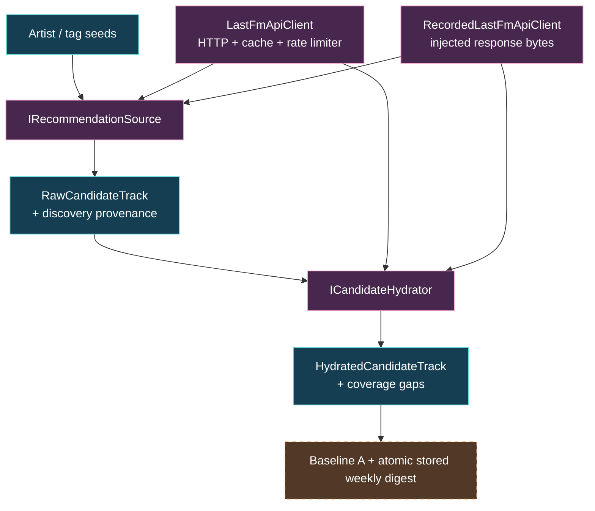

# Liner Notes · Developer guide

[Project overview](README.md) · [Current progress](PROGRESS.md) ·
[Product contracts](docs/renewal/contracts.md) · [Security policy](SECURITY.md)

This guide maps the `Prism` checkout so you can find a feature, follow its request
path and see where a change belongs. The product goal is a weekly list of three to
five music discoveries, each with an inspectable explanation and feedback that
shapes later picks. The complete generation and email flow is **not verified**.

## Start here

1. Read [PROGRESS.md](PROGRESS.md) for current work, open decisions and approval
   boundaries. Some historical comments and changelog entries describe intended
   behavior more broadly than the implementation supports.
2. Open [Presentation/Program.cs](src/Presentation/Program.cs) to see host setup,
   dependency injection, middleware and endpoint registration.
3. Follow a small feature: [DigestsController](src/Presentation/Controllers/DigestsController.cs)
   → [GetLatestDigestQueryHandler](src/Application/Features/Digests/Queries/GetLatestDigest/GetLatestDigestQueryHandler.cs)
   → [WeeklyDigestRepository](src/DataAccess/Persistence/Repositories/WeeklyDigestRepository.cs)
   → [MappingExtensions](src/Application/Common/Mappings/MappingExtensions.cs).
4. Read the [provider interfaces](src/Application/Common/Interfaces/Recommendation),
   then the [Last.fm adapter](src/Infrastructure/RecommendationSources/LastFm).
5. Explore [Domain scoring](src/Domain/Scoring) and its
   [tests](tests/Domain.Tests/Recommendation). Phase 6 generation uses popularity-neutral
   `BaselineAScorer`; the older scorer and its test contracts remain for compatibility.

## Repository map

| Location | Responsibility | Useful entry point |
| --- | --- | --- |
| [`src/Domain`](src/Domain) | Pure catalog, taste, digest and scoring models. No external package dependencies. | [`RecommendationScorer.cs`](src/Domain/Scoring/RecommendationScorer.cs) |
| [`src/Application`](src/Application) | MediatR commands and queries, validation, interfaces and DTOs. | [`Features/`](src/Application/Features) |
| [`src/DataAccess`](src/DataAccess) | EF Core persistence, Identity, repositories, configurations and migrations. | [`DataContext.cs`](src/DataAccess/DataContexts/DataContext.cs) |
| [`src/Infrastructure`](src/Infrastructure) | Last.fm HTTP access, cache, rate limiter, evidence parsing and replay. | [`DependencyInjection.cs`](src/Infrastructure/DependencyInjection.cs) |
| [`src/Presentation`](src/Presentation) | ASP.NET Core composition root, controllers, auth services and static browser UI. | [`Program.cs`](src/Presentation/Program.cs) |
| [`src/Worker`](src/Worker) | Second composition root. No scheduled digest or email job is registered yet. | [`Program.cs`](src/Worker/Program.cs) |
| [`tests/`](tests) | Domain, Application, DataAccess, Infrastructure and Presentation checks. | [`OnionArchitectureTests.cs`](tests/Domain.Tests/Architecture/OnionArchitectureTests.cs) |
| [`scripts/`](scripts) | Offline evaluation, replay, guarded recording and local checks. | [`phase4_pilot.py`](scripts/phase4_pilot.py) |
| [`docs/renewal`](docs/renewal) | Contracts, designs, evidence and local configuration. | [`contracts.md`](docs/renewal/contracts.md) |
| [`docs/architecture`](docs/architecture) | Nebula screenshot and capture notes. | [`README.md`](docs/architecture/README.md) |

## Dependencies and composition roots

Arrows mean **project references**, not runtime requests. This diagram follows the
current `.csproj` files; hosts reference adapters to wire implementations into DI.



Both hosts call `AddApplication`, `AddDataAccess` and `AddInfrastructure`.
Presentation also calls `AddPresentation` for auth and web services. Scoring stays
in Domain; provider HTTP stays in Infrastructure. Keep new provider implementations
behind Application's interfaces.

The runtime target is **.NET 10**, set in
[`Directory.Build.props`](Directory.Build.props). EF Core, Npgsql and several other
package references are currently **9.x**; check the project files before assuming
the packages match the framework's major version.

## Feature-to-code map

| If you want to understand… | Start with… | Then follow… |
| --- | --- | --- |
| Registration, login, refresh and account identity | [`AuthController`](src/Presentation/Controllers/AuthController.cs) | [`JwtService`](src/Presentation/Services/JwtService.cs), [`ApplicationUser`](src/DataAccess/IdentityEntities/ApplicationUser.cs) |
| Current-user access | [`CurrentUserService`](src/Presentation/Services/CurrentUserService.cs) | [`ApiControllerBase`](src/Presentation/Controllers/ApiControllerBase.cs) |
| Manual artist and tag seeds | [`TasteController`](src/Presentation/Controllers/TasteController.cs) | [`SeedTasteProfileCommandHandler`](src/Application/Features/Taste/Commands/SeedTasteProfile/SeedTasteProfileCommandHandler.cs), [`TasteSignal`](src/Domain/Taste/TasteSignal.cs) |
| Reading a stored digest | [`DigestsController`](src/Presentation/Controllers/DigestsController.cs) | [`GetLatestDigestQueryHandler`](src/Application/Features/Digests/Queries/GetLatestDigest/GetLatestDigestQueryHandler.cs), [`WeeklyDigestRepository`](src/DataAccess/Persistence/Repositories/WeeklyDigestRepository.cs) |
| Ratings and familiarity feedback | [`RecordRecommendationFeedbackCommandHandler`](src/Application/Features/Digests/Commands/RecordFeedback/RecordRecommendationFeedbackCommandHandler.cs) | [`WeeklyRecommendation`](src/Domain/Digest/WeeklyRecommendation.cs), [`command validator`](src/Application/Features/Digests/Commands/RecordFeedback/RecordRecommendationFeedbackCommandValidator.cs) |
| Offline digest generation | [`GenerateDigestCommandHandler`](src/Application/Features/Digests/Commands/GenerateDigest/GenerateDigestCommandHandler.cs) | [`Phase 6 evidence/configuration`](docs/renewal/phase-6-evidence.md), [`DigestGenerationStore`](src/DataAccess/Persistence/Repositories/DigestGenerationStore.cs) |
| Deterministic ranking and explanations | [`BaselineAScorer`](src/Domain/Scoring/BaselineAScorer.cs) | [`TasteVectorMaterializer`](src/Domain/Taste/TasteVectorMaterializer.cs), [`ScoreSnapshot`](src/Domain/Scoring/ScoreSnapshot.cs) |
| Provider candidate discovery | [`IRecommendationSource`](src/Application/Common/Interfaces/Recommendation/IRecommendationSource.cs) | [`LastFmRecommendationSource`](src/Infrastructure/RecommendationSources/LastFm/LastFmRecommendationSource.cs) |
| Candidate enrichment and missing evidence | [`ICandidateHydrator`](src/Application/Common/Interfaces/Recommendation/ICandidateHydrator.cs) | [`LastFmCandidateHydrator`](src/Infrastructure/RecommendationSources/LastFm/LastFmCandidateHydrator.cs), [`evidence models`](src/Application/Common/Models/Recommendation) |
| HTTP and replay parsing | [`LastFmEvidenceParser`](src/Infrastructure/RecommendationSources/LastFm/LastFmEvidenceParser.cs) | [`LastFmApiClient`](src/Infrastructure/RecommendationSources/LastFm/LastFmApiClient.cs), [`RecordedLastFmApiClient`](src/Infrastructure/RecommendationSources/LastFm/RecordedLastFmApiClient.cs) |
| Entity → API/export DTO mappings | [`MappingExtensions`](src/Application/Common/Mappings/MappingExtensions.cs) | [`DTOs/`](src/Application/DTOs) |
| Persistence and structured score storage | [`DataContext`](src/DataAccess/DataContexts/DataContext.cs) | [`entity configurations`](src/DataAccess/Persistence/Configurations), [`migrations`](src/DataAccess/Persistence/Migrations) |
| Export coverage | [`ExportController`](src/Presentation/Controllers/ExportController.cs) | [`GetUserDataExportQueryHandler`](src/Application/Features/Export/Queries/GetUserDataExport/GetUserDataExportQueryHandler.cs) |
| Account deletion | [`SubscribersController`](src/Presentation/Controllers/SubscribersController.cs) | [`DeleteUserAccountCommandHandler`](src/Application/Features/Subscribers/Commands/DeleteUserAccount/DeleteUserAccountCommandHandler.cs) |
| Browser behavior | [`wwwroot/app.js`](src/Presentation/wwwroot/app.js) | [`index.html`](src/Presentation/wwwroot/index.html), [`styles.css`](src/Presentation/wwwroot/styles.css) |

`DataContext` is the primary Identity-backed context. `AppDbContext` derives from
it as a compatibility wrapper used by existing consumers and migrations. General
repository infrastructure lives in [`DataAccess/Core`](src/DataAccess/Core), while
feature-specific repositories live in [`Persistence/Repositories`](src/DataAccess/Persistence/Repositories).

## Follow an actual request

Reading the latest digest goes to persisted data. It does not trigger provider
discovery or run the scorer.



Authentication can reject the request before the controller executes. Exceptions
are handled through [`ApiExceptionFilterAttribute`](src/Presentation/Filters/ApiExceptionFilterAttribute.cs).
[`ValidationBehavior`](src/Application/Common/Behaviors/ValidationBehavior.cs)
applies registered validators to MediatR requests.

### Current API entry points

Routes are declared in the controllers, with `api/[controller]` inherited from
`ApiControllerBase`. Swagger is available at `/swagger` in Development.

| Method | Path | Purpose |
| --- | --- | --- |
| POST | `/api/auth/register` | Register an account. |
| POST | `/api/auth/login` | Authenticate. |
| POST | `/api/auth/refresh` | Rotate a refresh token. |
| GET | `/api/auth/me` | Read current account identity. |
| GET | `/api/subscribers/me` | Read the subscriber profile. |
| DELETE | `/api/subscribers/me` | Request account deletion. |
| POST | `/api/taste/seed` | Add manual artist/tag seeds. |
| GET | `/api/taste/signals` | Read stored taste signals. |
| GET | `/api/digests/latest` | Read the latest stored digest. |
| POST | `/api/digests/recommendations/{recommendationId}/feedback` | Record sentiment, comment and/or a 1–10 rating. |
| GET | `/api/export/my-data` | Export the currently implemented data view. |
| GET | `/health` | Host health checks. |

This is a navigation map; consult the controller models, validators and Swagger
for request bodies and authorization requirements. No digest-generation endpoint
or weekly delivery job is implemented in this checkout.

## Data and explanations

This simplified relationship diagram shows the central product entities, not an
exhaustive inventory of every table or column.



`WeeklyRecommendation` holds the structured `ScoreBreakdown`. Its EF configuration
serializes the value into a PostgreSQL `jsonb` column. `WhyThisPick()` formats the
stored breakdown; it does not call a language model. `MappingExtensions` turns
these values into API DTOs, including the explanation.

Phase 6 verifies legacy/new JSON, nested unknown fields and inspectable unsupported
formula versions; unsupported versions fail explicit replay. Export 2.0 reads all digest
history through stable bounded pages and exposes full stored snapshots and audit fields.
Phase 8a still verifies the complete account inventory/deletion boundary independently.

## Discovery, replay and evaluation

The provider path produces transient evidence models that Phase 6 maps into complete
selected-pick snapshots. Stored-digest page views read persisted data. Host composition
selects explicit recorded or synthetic input; credentials cannot enable live generation.



- Reuse `LastFmEvidenceParser` for HTTP and replay. Missing provider values remain
  explicit gaps; do not invent tags, matches, listener counts or fallback evidence.
- `RecordedLastFmApiClient` accepts immutable response bytes. It performs no HTTP
  calls or file discovery.
- [`phase4_pilot.py`](scripts/phase4_pilot.py) and
  [`phase4_replay.cs`](scripts/phase4_replay.cs) support offline pilot evaluation.
  File-based .NET replay uses `--no-cache` to avoid stale compiled assemblies.
- [`record_lastfm.py`](scripts/record_lastfm.py) is the guarded live-recording entry
  point. A key does not authorize acquisition: real runs require an approved
  manifest and a fresh inventory. Keep recordings, reports and blind keys local
  and untracked.
- Synthetic benchmark and fixture results establish mechanics, not catalog
  coverage, formula superiority or personal musical fit.

## Local development

You need a .NET 10 SDK to build the solution. Persistence paths require an isolated
local PostgreSQL database matching your configuration. Python 3 runs the repository's
documentation checks and evaluation scripts.

```bash
dotnet restore 'Liner Notes.sln'
dotnet build 'Liner Notes.sln' --no-restore
```

Read [local configuration](docs/renewal/local-configuration.md) before starting the
host. Development settings contain explicit local-only defaults; configure your
database and apply the existing migrations to an isolated development database
before using account or persistence endpoints. Production secrets remain unset.
Do not assume `compose.yaml` provisions PostgreSQL: it currently defines only a
web service.

For a local browser session with fixture-only provider inputs:

```bash
ASPNETCORE_ENVIRONMENT=Development Generation__Origin=Synthetic \
  dotnet run --project src/Presentation/Presentation.csproj --no-launch-profile \
  -- --urls http://localhost:5080
```

Open `http://localhost:5080`; Development Swagger is at
`http://localhost:5080/swagger`. The UI and stored-data endpoints do not generate a
weekly digest on demand. No Last.fm key is needed for offline work. .NET does not
load `.env` automatically; use the documented environment or user-secrets setup.
This guide does not establish production deployment readiness.

### Verification commands

```bash
dotnet test 'Liner Notes.sln' --no-restore
python3 scripts/checks/renewal_docs.py
python3 scripts/checks/secret_defaults.py
```

These are commands for contributors; this documentation change does not rerun the
application suite. Database-dependent checks can skip without their configured
PostgreSQL instance. Read the [evidence](docs/renewal/phase-1-evidence.md) for the
distinction between offline checks, database checks and developer confirmation.

The founder-seed test is now an offline fixture test with an outbound-rejecting
handler, so the old README's exclusion is no longer needed. It proves isolation
mechanics rather than live provider coverage.

| Check area | Location |
| --- | --- |
| Scoring, taste and deterministic ranking | [`tests/Domain.Tests`](tests/Domain.Tests) |
| Handlers, validation and fixture evaluation | [`tests/Application.Tests`](tests/Application.Tests) |
| EF models, repositories, transactions and migrations | [`tests/DataAccess.Tests`](tests/DataAccess.Tests) |
| Provider parsing, rate limiting, ingestion and replay | [`tests/Infrastructure.Tests`](tests/Infrastructure.Tests) |
| Controllers, auth and host security | [`tests/Presentation.Tests`](tests/Presentation.Tests) |

## Explore the Nebula


The image is a snapshot of Codebase Memory's indexed source relationships. Use it
to orient yourself, then follow source links and tests. See the
[capture notes](docs/architecture/README.md) for provenance, scope and refresh
instructions. Graph-resolved calls are best-effort analysis; project references
and actual source remain the authority for dependency boundaries.

## Before you change something

Read [AGENTS.md](AGENTS.md) for project conventions. Keep scoring pure, configuration
explicit, explanations tied to stored data and upstream services swappable. A
scorer change needs a benchmark sanity check. Update [CHANGELOG.md](CHANGELOG.md)
for user-visible changes and keep local commits focused.

Resolve the relevant [product contract](docs/renewal/contracts.md) before changing
schema, public API/export behavior, acquisition rules or scoring policy. V1's
approved scope excludes custom ML, payments, social features and playlist sync.

For security findings, use [private vulnerability reporting](SECURITY.md).
