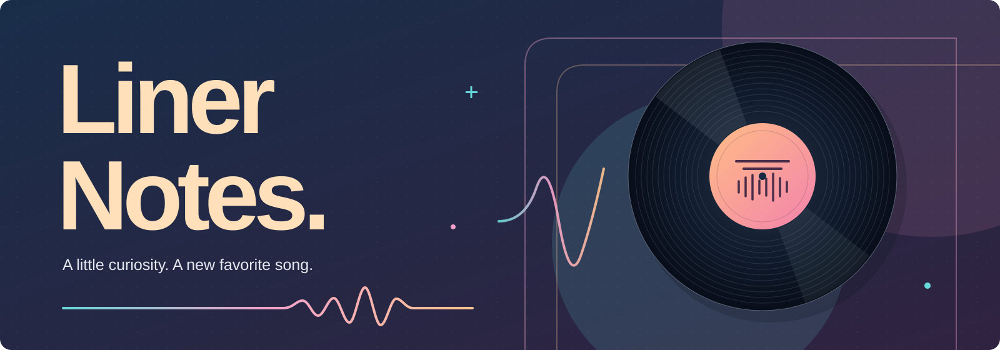
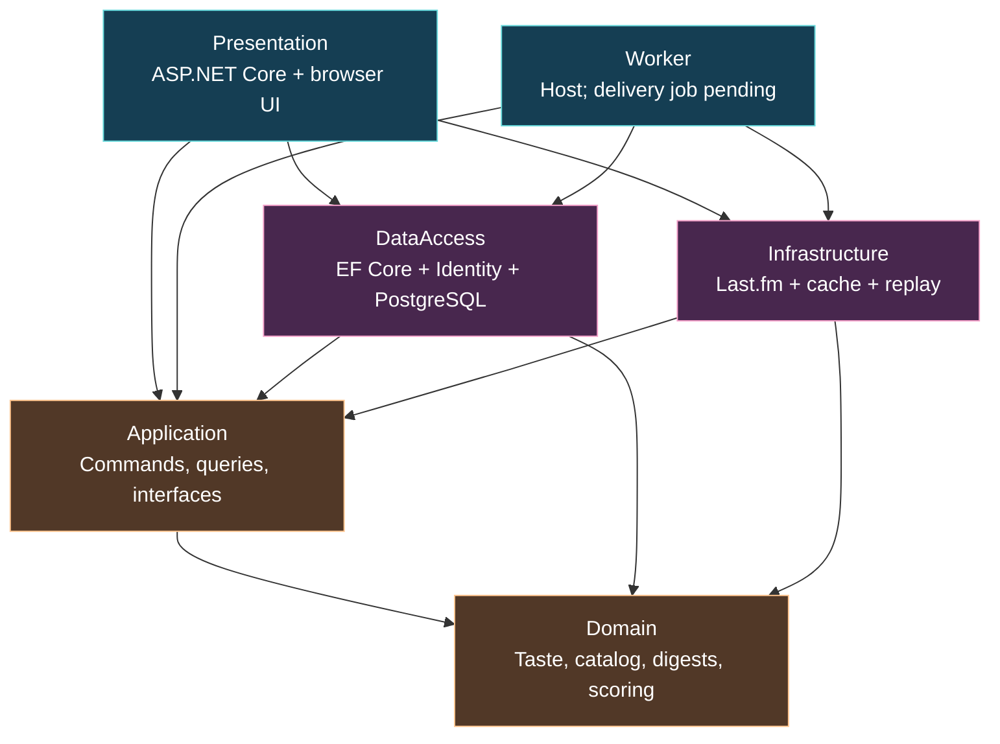
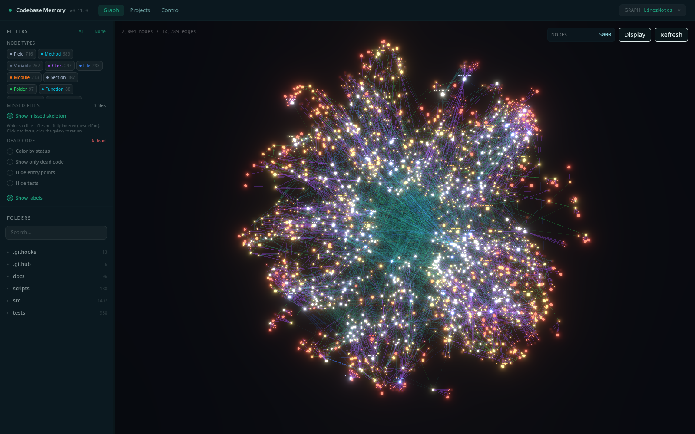

  

<h1 align="center">Liner Notes</h1>

  <strong>Step outside your comfort zone. Find your next favorite song.</strong>

  An open-source project for a small weekly music discovery list, 
  with a reason behind every pick and a say in what comes next.

  <a href="#the-idea">The idea</a> ·
  <a href="#the-listening-ritual">The listening ritual</a> ·
  <a href="#where-we-are">Where we are</a> ·
  <a href="#for-developers">For developers</a>

---

## The idea

You know the songs you reach for without thinking. The album that lives on repeat.
The soundtrack you keep coming back to. There is a whole world of music just beyond
that familiar loop.

**Liner Notes is being built to help you take that next step.** Our goal is to send
you **three to five discoveries each week**, starting from the music you already
love. A few tracks to spend time with, each carrying an explanation of why it made
the list.

The name comes from the notes tucked inside a record sleeve: context that makes
listening a little richer. We want recommendations to offer that same invitation.
What connected this song to your taste? What did your feedback change? You should
be able to see the answers.

> Your next favorite song might be somewhere you haven't thought to look.

## The listening ritual

This is the experience we are working toward:

| Start with a spark | Give it a listen | Shape the next week |
| --- | --- | --- |
| Tell us about artists and genres you love. | Explore a short weekly list and the reason behind each pick. | Rate a track from 1–10, or mark it as already known. |

Your taste can move. The list should move with it.

### What matters to us

- **A reason for every pick.** Explanations come from stored scoring details,
  including the musical tags that connected a candidate to your taste.
- **Room for discovery.** Known and disliked tracks should be excluded, while
  other tracks by the same artist can still have their moment.
- **Popularity-neutral V1.** Being famous or obscure should carry no automatic
  preference or penalty.
- **Your taste belongs to you.** The goal is to let you inspect and export the
  taste data we hold, and delete your account and its data.
- **An inbox you control.** Weekly email is planned with unsubscribe in every
  message and no tracking pixels.

These are product goals. The status below describes what is currently available
in the repository.

## How a pick gets its notes

Candidates and similarity evidence come from upstream music services. A Last.fm
client exists today; ListenBrainz support and listening-history imports are
deferred. Liner Notes applies deterministic scoring and feedback re-ranking to
that evidence. We do not build the providers' similarity data or claim a new
recommendation algorithm. V1 uses no custom machine learning.

*Intended weekly flow. A complete pipeline and weekly email delivery are not verified.*

## Where we are

**Liner Notes is under active development on `Prism`.** This repository is a place
to explore and contribute to the project; it is not a production-ready service.

| In the code today | Still being built or evaluated |
| --- | --- |
| A browser UI, account endpoints, manual taste seeds, digest reading and feedback. | Scheduled email delivery and production acquisition. |
| Last.fm discovery, evidence parsing, fixture inputs and recorded-response replay. | ListenBrainz integration and username/listening-history imports. |
| Bounded offline generation with pure baseline-A scoring, versioned stored evidence and PostgreSQL checks. | Real recommendation-quality evaluation and supported capacity. |
| Export and deletion paths with local checks. | Verification of complete data export and deletion coverage. |

Synthetic fixtures demonstrate mechanics; they do not establish musical fit.
Local verification also awaits developer confirmation. Complete data portability,
privacy compliance and exactly-once email delivery are not claimed.

[Progress and open work](PROGRESS.md) ·
[Product contracts](docs/renewal/contracts.md) ·
[Verification evidence](docs/renewal/phase-1-evidence.md) ·
[Changelog](CHANGELOG.md)

## For developers

The code is organized around a pure Domain, an Application layer for orchestration,
and adapters for storage and music providers. The web host lives in
[`src/Presentation`](src/Presentation); [`src/Worker`](src/Worker) is a second
composition root, with batch delivery still to be implemented.

### The architecture at a glance

Arrows show **project references**, pointing toward the code a project depends on.

Domain has no external package dependencies. Provider calls stay in Infrastructure;
the web request path reads stored digests rather than discovering music per page
view. Runtime targets .NET 10; EF Core and several package references remain 9.x.

### Inside the Nebula

The project's source relationships, captured from **Codebase Memory's Nebula
viewer**. This is an exploratory source graph, including tests and tooling;
it is not a runtime trace or proof that every connection was resolved correctly.
The [snapshot notes](docs/architecture/README.md) explain its scope and how it was
captured.

**Start with [README-Developer.md](README-Developer.md)** for the folder map,
feature-to-code mappings, request and data diagrams, API routes, local setup,
and a suggested reading order.

## Add something to the mix

Developers, listeners and people who care about explainable music discovery are
welcome. A clearer explanation, a reproducible bug report or a thoughtful product
discussion can help shape the project.

Read the [developer guide](README-Developer.md) and [current progress](PROGRESS.md)
before taking on a change. Use
[issues](https://github.com/Jafarli-Mahammad/Liner-Notes/issues) for ordinary bugs
and ideas, and the [security policy](SECURITY.md) for private vulnerability reports.

Liner Notes is licensed under [AGPL-3.0](LICENSE).

---

<em>Leave a little room in your week for a song you haven't met yet.</em>

