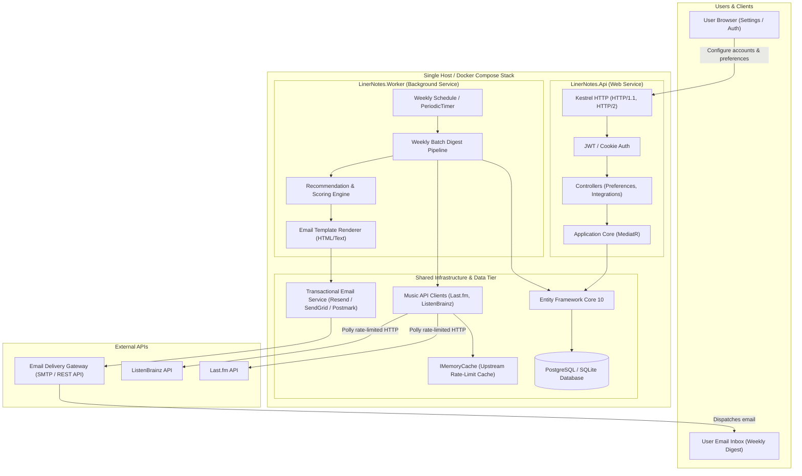
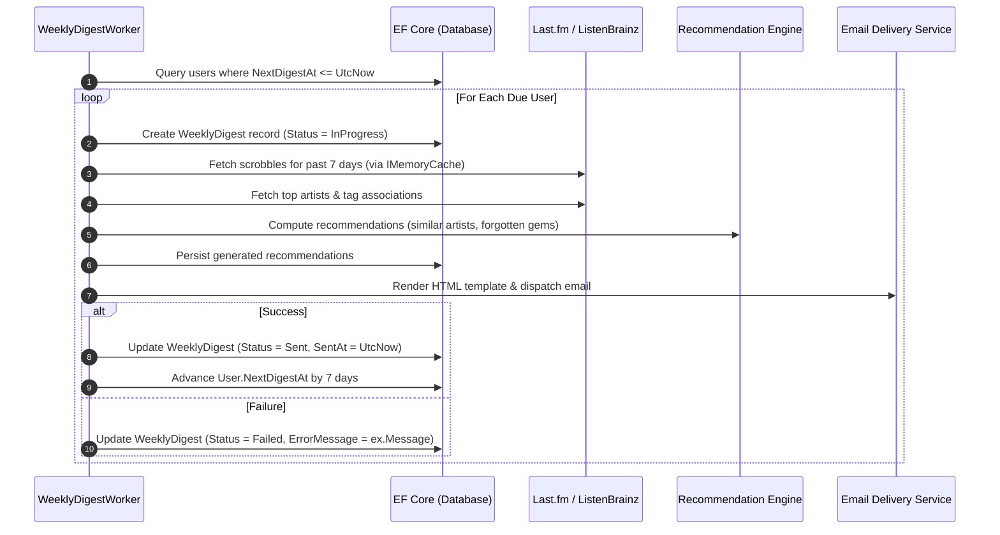

> Renewal qualification (2026-10-06): this is a target specification, not verified implementation.
> The [renewal contracts](docs/renewal/contracts.md#specification-reconciliation) supersede conflicting examples: six layers, popularity-neutral V1, deferred imports, physical deletion, and email without remote resources. Numeric API allowances and provider pricing below are not verified. Dependency, schema and deployment changes remain approval-gated.

# 🎵 Liner Notes V1 — Architecture & Infrastructure Specification

**Document Version:** 1.0.0 (V1 Lean Production)  
**Target Runtime:** .NET 10.0 / C# 13.0 / Linux Container (Single VPS)  
**Architectural Style:** Clean Architecture + CQRS + Dedicated Batch Worker  
**Philosophy:** Lean, Pragmatic, Zero Premature Overhead (No Redis, No SignalR, No Dapper, Single DB/Cache)  

---

## 📑 Table of Contents

1. [Executive Summary & Architectural Paradigm](#1-executive-summary--architectural-paradigm)
2. [What Was Stripped & Why (Pragmatic Comparison)](#2-what-was-stripped--why-pragmatic-comparison)
3. [High-Level System Topology](#3-high-level-system-topology)
4. [Solution Structure & Project Taxonomy](#4-solution-structure--project-taxonomy)
5. [Presentation Layer (`LinerNotes.Api`)](#5-presentation-layer-linernotesapi)
   - 5.1. [Lean Kestrel Configuration](#51-lean-kestrel-configuration)
   - 5.2. [Middleware Pipeline & Error Handling](#52-middleware-pipeline--error-handling)
   - 5.3. [Single Unified Swagger / OpenAPI](#53-single-unified-swagger--openapi)
   - 5.4. [Endpoint Responsibilities](#54-endpoint-responsibilities)
6. [Batch Processing Engine (`LinerNotes.Worker`)](#6-batch-processing-engine-linernotesworker)
   - 6.1. [Execution Lifecycle & Scheduling](#61-execution-lifecycle--scheduling)
   - 6.2. [Weekly Batch Pipeline Stages](#62-weekly-batch-pipeline-stages)
   - 6.3. [Idempotency & Fault Tolerance](#63-idempotency--fault-tolerance)
7. [External Music API Integrations & Upstream Caching](#7-external-music-api-integrations--upstream-caching)
   - 7.1. [Last.fm & ListenBrainz Integration Clients](#71-lastfm--listenbrainz-integration-clients)
   - 7.2. [Polly Resilience, Rate-Limiting & Retries](#72-polly-resilience-rate-limiting--retries)
   - 7.3. [In-Memory Upstream Caching (`IMemoryCache`)](#73-in-memory-upstream-caching-imemorycache)
8. [Application Layer & CQRS Core (`LinerNotes.Application`)](#8-application-layer--cqrs-core-linernotesapplication)
   - 8.1. [MediatR Architecture & Pipeline Behaviors](#81-mediatr-architecture--pipeline-behaviors)
   - 8.2. [Feature-Sliced Modules](#82-feature-sliced-modules)
9. [Domain Layer & Entities (`LinerNotes.Domain`)](#9-domain-layer--entities-linernotesdomain)
   - 9.1. [Core Domain Model Hierarchy](#91-core-domain-model-hierarchy)
   - 9.2. [Auditability Contract (`IAuditableEntity`)](#92-auditability-contract-iauditableentity)
10. [Persistence & Data Access (`LinerNotes.Infrastructure`)](#10-persistence--data-access-linernotesinfrastructure)
    - 10.1. [Single ORM Approach (EF Core 10)](#101-single-orm-approach-ef-core-10)
    - 10.2. [Database Provider (PostgreSQL or SQLite)](#102-database-provider-postgresql-or-sqlite)
    - 10.3. [Soft Deletes & Query Filters](#103-soft-deletes--query-filters)
11. [Email Generation & Dispatch Subsystem](#11-email-generation--dispatch-subsystem)
    - 11.1. [Template Rendering (HTML + Plaintext)](#111-template-rendering-html--plaintext)
    - 11.2. [Transactional Delivery Provider (`IEmailService`)](#112-transactional-delivery-provider-iemailservice)
12. [Security, Authentication & Token Management](#12-security-authentication--token-management)
    - 12.1. [User Authentication](#121-user-authentication)
    - 12.2. [Secure Token Storage for Music Services](#122-secure-token-storage-for-music-services)
13. [Deployment Topology & Docker Compose](#13-deployment-topology--docker-compose)
14. [Observability & Health Checks](#14-observability--health-checks)
15. [Production Hardening & Operational Checklist](#15-production-hardening--operational-checklist)

---

## 1. Executive Summary & Architectural Paradigm

**Liner Notes V1** is a personal weekly music recommendation digest tool. Its primary function is to:
1. Connect to users' scrobble/listening history accounts (Last.fm, ListenBrainz, Spotify).
2. Ingest listening history on a weekly schedule.
3. Compute personalized music recommendations, discovery picks, and listening stats.
4. Render a beautiful weekly digest email and dispatch it directly to users' inboxes.

### Core Architectural Principle: Pragmatic & Lean
Liner Notes V1 runs on a single inexpensive VPS (or small container instance). The architecture eliminates all distributed overhead (no Redis cluster, no SignalR web sockets, no Dapper micro-ORM, no multi-role OpenAPI partitioning) in favor of standard, battle-tested .NET primitives: **EF Core 10**, **MediatR**, **`IMemoryCache`**, and a dedicated **`Worker`** background service.

---

## 2. What Was Stripped & Why (Pragmatic Comparison)

| Overengineered Pattern | Why High-Traffic APIs Need It | Why Liner Notes V1 Does NOT Need It | V1 Lean Replacement |
| :--- | :--- | :--- | :--- |
| **SignalR + MessagePack + Redis Backplane** | Real-time scoreboards, live jury broadcasts | A weekly email digest has zero live/push component | **Completely Removed** |
| **Dapper + DapperPagedRepositoryBase** | High-frequency public listing reads with thousands of req/sec | Weekly batch generation with low read volume | **EF Core 10 Alone** (Clean LINQ, compiled queries if needed) |
| **HybridCache (L1 Memory + L2 Redis)** | Sub-millisecond distributed caching across clustered nodes | No cluster; needs caching for upstream API rate limits | **`IMemoryCache`** (In-process memory with sliding expiration) |
| **HTTP/3 QUIC, 100k Conns, SIMD ETags, DbContextPool(128)** | High-concurrency spikes during live events | Low web traffic on a cheap VPS; requests are primarily user preference edits | **Standard Kestrel HTTP/1.1 & HTTP/2, Standard `AddDbContext`** |
| **4-Way Partitioned Swagger** | 5 distinct access roles (Admin, Partner, Company, Jury, Student) | Single consumer role + optional admin toggle | **Single Unified Swagger UI (`/swagger/v1`)** |
| **No Dedicated Worker Project** | Request/Response-only API hosting | Weekly batch jobs need an isolated lifecycle that doesn't block web threads | **Dedicated `LinerNotes.Worker` Project** |

---

## 3. High-Level System Topology



---

## 4. Solution Structure & Project Taxonomy

```
LinerNotes.sln
├── src/
│   ├── LinerNotes.Api/            # REST API entrypoint (auth, user settings, manual preview triggers)
│   ├── LinerNotes.Worker/         # Dedicated background batch service for the weekly digest pipeline
│   ├── LinerNotes.Application/    # CQRS commands/queries, MediatR, interfaces, DTOs, validators
│   ├── LinerNotes.Domain/         # Domain aggregates, entities, enums, value objects (pure C#)
│   └── LinerNotes.Infrastructure/ # EF Core DbContext, external music API clients, email service
└── tests/
    └── LinerNotes.Tests/          # Unit tests, handler tests, recommendation logic tests
```

### Unified Compiler Properties (`Directory.Build.props`)
```xml
<Project>
  <PropertyGroup>
    <TargetFramework>net10.0</TargetFramework>
    <Nullable>enable</Nullable>
    <ImplicitUsings>enable</ImplicitUsings>
    <TreatWarningsAsErrors>false</TreatWarningsAsErrors>
  </PropertyGroup>
</Project>
```

---

## 5. Presentation Layer (`LinerNotes.Api`)

### 5.1. Lean Kestrel Configuration
No connection-pooling over-allocations, no QUIC overhead. Standard HTTP/1.1 and HTTP/2:
```csharp
// Program.cs
var builder = WebApplication.CreateBuilder(args);

// Standard Kestrel defaults are ideal for a low-to-medium traffic web API
builder.WebHost.ConfigureKestrel(options =>
{
    options.AddServerHeader = false;
});
```

### 5.2. Middleware Pipeline & Error Handling
```csharp
var app = builder.Build();

app.UseExceptionHandler(); // RFC 7807 ProblemDetails
app.UseHttpsRedirection();
app.UseAuthentication();
app.UseAuthorization();

if (app.Environment.IsDevelopment())
{
    app.UseSwagger();
    app.UseSwaggerUI(c => c.SwaggerEndpoint("/swagger/v1/swagger.json", "Liner Notes API v1"));
}

app.MapControllers();
app.MapHealthChecks("/health");

app.Run();
```

### 5.3. Single Unified Swagger / OpenAPI
A clean, single-document Swagger configuration:
```csharp
builder.Services.AddEndpointsApiExplorer();
builder.Services.AddSwaggerGen(options =>
{
    options.SwaggerDoc("v1", new OpenApiInfo
    {
        Title = "Liner Notes API",
        Version = "v1",
        Description = "Personal Music Recommendation & Weekly Digest API"
    });
});
```

### 5.4. Endpoint Responsibilities
The Web API handles interactive user tasks:
- `POST /api/auth/register` & `POST /api/auth/login`: User onboarding.
- `GET /api/me` & `PUT /api/me/preferences`: Manage digest day of week, genres, blacklist artists.
- `POST /api/connections/lastfm` & `POST /api/connections/listenbrainz`: Link music profiles.
- `POST /api/digests/preview`: Generate an on-demand preview email sent to the authenticated user.
- `GET /api/digests/history`: View past sent digests and recommended tracks.

---

## 6. Batch Processing Engine (`LinerNotes.Worker`)

The `Worker` project is an autonomous `BackgroundService` that handles the heavy lifting without degrading API responsiveness.

### 6.1. Execution Lifecycle & Scheduling
Uses a standard .NET `PeriodicTimer` or cron-like timer checking hourly for users whose digest window has opened:

```csharp
public class WeeklyDigestWorker(
    IServiceScopeFactory scopeFactory,
    ILogger<WeeklyDigestWorker> logger) : BackgroundService
{
    protected override async Task ExecuteAsync(CancellationToken stoppingToken)
    {
        using var timer = new PeriodicTimer(TimeSpan.FromHours(1));

        while (!stoppingToken.IsCancellationRequested && await timer.WaitForNextTickAsync(stoppingToken))
        {
            try
            {
                using var scope = scopeFactory.CreateScope();
                var orchestrator = scope.ServiceProvider.GetRequiredService<IDigestBatchOrchestrator>();
                await orchestrator.ProcessDueDigestsAsync(stoppingToken);
            }
            catch (Exception ex)
            {
                logger.LogError(ex, "Unhandled error during weekly digest batch execution");
            }
        }
    }
}
```

### 6.2. Weekly Batch Pipeline Stages



### 6.3. Idempotency & Fault Tolerance
- **Strict Status Tracking:** Every digest creation begins with `DigestStatus.Pending` or `InProgress`. If a failure occurs mid-generation, the batch marks the record `Failed` with error telemetry.
- **Deduplication Constraint:** A unique database constraint on `(UserId, WeekStartDate)` prevents accidental duplicate email generation for the same week.
- **Graceful Cancellation:** All pipeline methods pass through `CancellationToken`, cleanly shutting down without orphan database locks when the worker restarts.

---

## 7. External Music API Integrations & Upstream Caching

### 7.1. Last.fm & ListenBrainz Integration Clients
External API clients are typed `HttpClient` implementations registered via `AddHttpClient`:
- **Last.fm Client:** Fetches user recent tracks (`user.getRecentTracks`), top artists (`user.getTopArtists`), and artist similar picks (`artist.getSimilar`).
- **ListenBrainz Client:** Fetches user listens (`/1/user/{username}/listens`) and recording feedback.

### 7.2. Polly Resilience, Rate-Limiting & Retries
Both Last.fm (5 req/sec limit) and ListenBrainz enforce upstream quotas. We use .NET 10 `Microsoft.Extensions.Http.Resilience` to guarantee compliance without Redis:

```csharp
builder.Services.AddHttpClient<ILastFmClient, LastFmClient>(client =>
{
    client.BaseAddress = new Uri("https://ws.audioscrobbler.com/2.0/");
    client.Timeout = TimeSpan.FromSeconds(15);
})
.AddResilienceHandler("lastfm-pipeline", pipeline =>
{
    // Retry on 429 Too Many Requests and 5xx server errors
    pipeline.AddRetry(new HttpRetryStrategyOptions
    {
        MaxRetryAttempts = 3,
        Delay = TimeSpan.FromSeconds(2),
        BackoffType = DelayBackoffType.Exponential,
        UseJitter = true
    });

    // Rate limiter: Max 5 requests per second
    pipeline.AddRateLimiter(new FixedWindowRateLimiter(new FixedWindowRateLimiterOptions
    {
        PermitLimit = 5,
        Window = TimeSpan.FromSeconds(1),
        QueueLimit = 100
    }));
});
```

### 7.3. In-Memory Upstream Caching (`IMemoryCache`)
Upstream responses that do not change frequently (e.g. artist metadata, tags, similar artist lists) are cached in `IMemoryCache` for 24–48 hours:
- Avoids redundant API calls across multiple users with overlapping music tastes.
- Preserves external API rate limits with zero extra infrastructure.

---

## 8. Application Layer & CQRS Core (`LinerNotes.Application`)

### 8.1. MediatR Architecture & Pipeline Behaviors
All business use-cases are structured as MediatR commands and queries:
- **`ValidationBehavior<TRequest, TResponse>`:** Validates commands automatically using FluentValidation before handlers run.
- **`LoggingBehavior<TRequest, TResponse>`:** Logs command execution times and correlation IDs.

### 8.2. Feature-Sliced Modules
```
Application/
├── Common/
│   ├── Behaviors/       # ValidationBehavior, LoggingBehavior
│   ├── Exceptions/      # NotFoundException, ValidationException
│   └── Interfaces/      # IApplicationDbContext, IEmailService, IMusicIntegrationService
└── Modules/
    ├── Auth/            # RegisterCommand, LoginCommand
    ├── Users/           # UpdatePreferencesCommand, GetUserProfileQuery
    ├── Connections/     # ConnectLastFmCommand, ConnectListenBrainzCommand
    ├── Recommendations/ # GenerateRecommendationsQuery, ComputeWeeklyDigestCommand
    └── Digests/         # GetDigestHistoryQuery, SendTestDigestCommand
```

---

## 9. Domain Layer & Entities (`LinerNotes.Domain`)

### 9.1. Core Domain Model Hierarchy

```
User (Aggregate Root)
├── Id, Email, PasswordHash, TimeZone
├── DigestDayOfWeek (e.g. Sunday)
├── DigestDeliveryHourUtc (e.g. 08:00)
├── NextDigestAt
├── Connections: List<UserMusicConnection>
│   ├── ServiceType (LastFm, ListenBrainz, Spotify)
│   ├── ExternalUsername
│   ├── ApiKeyOrToken (Encrypted)
│   └── LastSyncedAt
└── Digests: List<WeeklyDigest>
    ├── WeekStartDate, WeekEndDate
    ├── Status (Pending, InProgress, Sent, Failed)
    ├── SentAt, ErrorMessage
    └── Recommendations: List<WeeklyRecommendation>
        ├── TrackTitle, ArtistName, AlbumTitle
        ├── RecommendationReason (e.g. "Because you listened to Radiohead 18 times")
        ├── ExternalSpotifyUrl, ExternalYoutubeUrl
        └── UserFeedback (Liked, Disliked, None)
```

### 9.2. Auditability Contract (`IAuditableEntity`)
Entities track basic creation and modification timestamps:
```csharp
public interface IAuditableEntity
{
    DateTime CreatedAt { get; set; }
    DateTime? LastModifiedAt { get; set; }
}
```

---

## 10. Persistence & Data Access (`LinerNotes.Infrastructure`)

### 10.1. Single ORM Approach (EF Core 10)
- **No Dapper:** EF Core 10 provides first-class query performance for weekly batch workloads. Dapper's micro-ORM complexity is unnecessary.
- **Clean Configuration:** Standard entity configurations implementing `IEntityTypeConfiguration<T>`.

### 10.2. Database Provider (PostgreSQL or SQLite)
- **Production Choice: PostgreSQL 16+** (via `Npgsql.EntityFrameworkCore.PostgreSQL`).
- **Alternative for Solo Zero-Cost VPS: SQLite** (via `Microsoft.EntityFrameworkCore.Sqlite`).
- Standard registration:
```csharp
builder.Services.AddDbContext<AppDbContext>(options =>
    options.UseNpgsql(builder.Configuration.GetConnectionString("DefaultConnection")));
```

### 10.3. Soft Deletes & Query Filters
- Users and connections use an `IsDeleted` flag with global EF Core query filters (`builder.Entity<User>().HasQueryFilter(u => !u.IsDeleted)`).
- Filtered unique index:
```csharp
builder.Entity<WeeklyDigest>()
    .HasIndex(d => new { d.UserId, d.WeekStartDate })
    .IsUnique();
```

---

## 11. Email Generation & Dispatch Subsystem

### 11.1. Template Rendering (HTML + Plaintext)
Weekly emails are rendered using clean C# string templating or a lightweight template engine (such as **Fluid** or **Scriban**):
- **HTML Version:** Responsive, modern newsletter design with album art, track links, and personalized listening statistics.
- **Plaintext Version:** High-deliverability fallback for text-only email clients.

### 11.2. Transactional Delivery Provider (`IEmailService`)
Abstracted behind a clean interface:
```csharp
public interface IEmailService
{
    Task SendWeeklyDigestAsync(
        string recipientEmail,
        WeeklyDigestDto digest,
        CancellationToken cancellationToken = default);
}
```
**Recommended Providers for V1:**
- **Resend** (Generous free tier: 3,000 emails/month, modern REST API).
- **SendGrid / Postmark / Amazon SES** (Alternate plug-and-play REST or SMTP providers).

---

## 12. Security, Authentication & Token Management

### 12.1. User Authentication
- Standard JWT Bearer tokens or ASP.NET Core Identity Cookies for user login.
- Password hashing using `PasswordHasher<T>` (Argon2 / PBKDF2).

### 12.2. Secure Token Storage for Music Services
- User tokens for external music services (Spotify OAuth access/refresh tokens, ListenBrainz user tokens) are encrypted at rest using **ASP.NET Core Data Protection** (`IDataProtectionProvider`) before saving to the database.

---

## 13. Deployment Topology & Docker Compose

A single-host deployment on an inexpensive VPS (e.g. Hetzner, DigitalOcean, or Linode at $4–$6/month):

```yaml
services:
  db:
    image: postgres:16-alpine
    container_name: linernotes-db
    restart: unless-stopped
    environment:
      POSTGRES_DB: linernotes
      POSTGRES_USER: linernotes_user
      POSTGRES_PASSWORD: ${DB_PASSWORD}
    volumes:
      - postgres-data:/var/lib/postgresql/data
    healthcheck:
      test: ["CMD-SHELL", "pg_isready -U linernotes_user -d linernotes"]
      interval: 10s
      timeout: 5s
      retries: 5

  api:
    build:
      context: .
      dockerfile: src/LinerNotes.Api/Dockerfile
    container_name: linernotes-api
    restart: unless-stopped
    depends_on:
      db:
        condition: service_healthy
    environment:
      - ASPNETCORE_ENVIRONMENT=Production
      - ConnectionStrings__DefaultConnection=Host=db;Database=linernotes;Username=linernotes_user;Password=${DB_PASSWORD}
      - Jwt__SecretKey=${JWT_SECRET}
    ports:
      - "8080:8080"

  worker:
    build:
      context: .
      dockerfile: src/LinerNotes.Worker/Dockerfile
    container_name: linernotes-worker
    restart: unless-stopped
    depends_on:
      db:
        condition: service_healthy
    environment:
      - DOTNET_ENVIRONMENT=Production
      - ConnectionStrings__DefaultConnection=Host=db;Database=linernotes;Username=linernotes_user;Password=${DB_PASSWORD}
      - LastFm__ApiKey=${LASTFM_API_KEY}
      - Resend__ApiKey=${RESEND_API_KEY}

volumes:
  postgres-data:
```

---

## 14. Observability & Health Checks

1. **Structured Logging:** Centralized logging using Serilog writing to console (standard Docker log collector).
2. **Health Check Endpoints:**
   - `LinerNotes.Api`: Exposes `/health` validating DB connectivity via `AddDbContextCheck<AppDbContext>()`.
   - `LinerNotes.Worker`: Emits periodic heartbeat log entries at every timer tick.

---

## 15. Production Hardening & Operational Checklist

- [ ] **Idempotent Delivery:** Ensure the unique constraint on `(UserId, WeekStartDate)` is active to prevent emailing the same user twice.
- [ ] **Polly Upstream Rate Limiting:** Enforce the 5 req/sec limit on Last.fm to prevent temporary IP bans.
- [ ] **Data Protection Key Persistence:** Configure `PersistKeysToDbContext` or mount a persistent directory for ASP.NET Core Data Protection keys so encryption remains valid across container restarts.
- [ ] **Graceful Worker Shutdown:** Ensure all batch iteration loops respect `CancellationToken` to avoid partial batch corruption during redeploys.
- [ ] **Bounce & Unsubscribe Handling:** Every email must include a functional one-click unsubscribe link pointing to `GET /api/digests/unsubscribe?token=...`.
